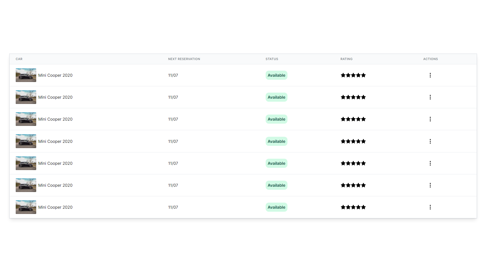
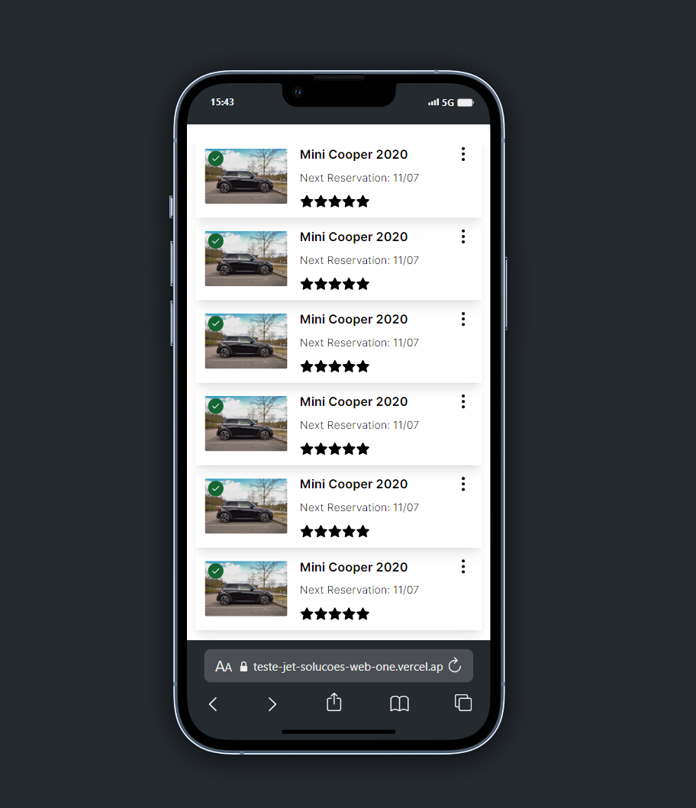

<p align='center'></p>

 <p align='center'>


  
</p>

## 🚀 Da uma olhada no resultado:

## - [Deploy](https://teste-jet-solucoes-web-one.vercel.app/)

## 🚀 Tecnologias

Este projeto está utilizando as seguintes tecnologias:

- [TypeScript](https://www.typescriptlang.org/)
- [React](https://react.dev/)
- [Next](https://nextjs.org/)
- [Tailwind](https://tailwindcss.com/)

## 📜 Descrição

Este é o projeto referente ao teste para Desenvolvedor Front-end da [JetSolutionsWeb](https://www.jetsolucoesweb.com.br/).
O desafio foi criar uma tabela com dados estáticos totalmente reponsiva que se adaptasse tanto para desktop como para mobile utililazando TypeScript, ReactJS, NextJs e TailwindCSS.

## ⚙️ Como funciona?

Parte da responsividade foi desenvolvida utilizando as classes do tailwind, para o restante foi criada uma função
que verifica o tamanho da tela do usuário e renderiza o componente adequando para cada tela.

## 🎲 Quer customizar o projeto?

### Clone esse repositório

```bash
git clone https://github.com/Savio-Anjos/Teste-JetSolucoesWeb.git
```

### Navegue até o diretório do projeto

```bash
cd Teste-JetSolucoesWeb
```

### Instale as dependências

```bash
npm i
```

```bash
yarn
```

### Inicie a aplicação

```bash
npm run dev
```

```bash
yarn dev
```

### Layout Desktop



### Layout Mobile



---

<p>Criado com 💙 por <a href='https://github.com/Savio-Anjos/' target='_blank'>Sávio Anjos</a></p>
